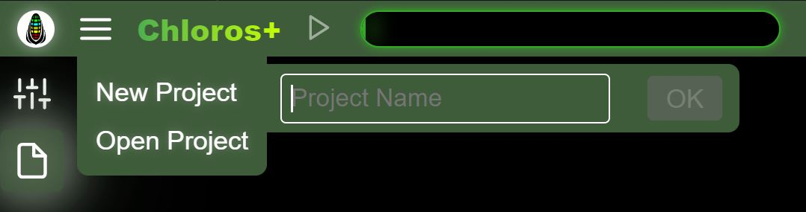

# Interface graphique : Projets

Chloros vous permet de créer des projets que vous pourrez rouvrir ultérieurement.

## Nouveau projet

<figure><figcaption></figcaption></figure>Sélectionnez « Nouveau projet » dans le menu principal et entrez un nom unique pour votre projet.

## Ouvrir un projet

<figure><figcaption></figcaption></figure>Sélectionnez « Ouvrir un projet » pour afficher la liste des projets existants dans le dossier de projets. Si aucun projet n&#x27;existe, le menu latéral secondaire ne s&#x27;ouvrira pas. Vous pouvez voir certains projets créés par l&#x27;interface graphique (t1, t2, t3) répertoriés sur la photo ci-dessus. Les projets DATE\_TIME ont été créés par CLI en utilisant le schéma de nommage par défaut. Cliquez sur le nom d&#x27;un projet pour l&#x27;ouvrir.

Cliquer sur le bouton « Ouvrir le dossier du projet » ouvre l&#x27;explorateur de fichiers de votre ordinateur à l&#x27;emplacement du projet. Vous pouvez modifier l&#x27;emplacement du projet dans les [Paramètres du projet](project-settings/project-settings.md).

## Ajouter des fichiers

Une fois le projet ouvert, sélectionnez « Ajouter des fichiers » dans le menu principal pour ajouter des fichiers image individuels au projet en cours. Cette fonction est similaire à celle du navigateur de fichiers, mais est accessible directement depuis le menu principal pour plus de commodité.

## Ajouter un dossier

Une fois le projet ouvert, sélectionnez « Ajouter un dossier » dans le menu principal pour ajouter un dossier entier d&#x27;images au projet en cours. Les fichiers en double sont ignorés.

## Démarrer / Arrêter le traitement

Une fois les fichiers ajoutés à un projet, l&#x27;option « Démarrer le traitement » devient disponible dans le menu principal. Cela revient à cliquer sur le bouton Lecture/Démarrer situé dans l&#x27;en-tête supérieur. Pendant le traitement, l&#x27;option du menu devient « Arrêter le traitement » pour vous permettre d&#x27;interrompre le pipeline.


Les options de menu Ajouter des fichiers, Ajouter un dossier et Démarrer/Arrêter le traitement ne sont visibles ou activées que lorsqu&#x27;un projet est ouvert et que des fichiers ont été ajoutés. Elles permettent d&#x27;accéder rapidement à des actions également disponibles via la barre latérale du navigateur de fichiers et les boutons de l&#x27;en-tête.

